#Welcome!

Here I would like to introduce my project for course "Cloud Computing". I had to computate data using Apache Spark on Amazon.

For my project I used dataset "Wine Data Set" downloaded from https://archive.ics.uci.edu/ml/datasets/Wine. For computations I used only one atribute "quality". 

My code written in Python 3 compute total amount of this atribute and its unique values. You can see it in file "computations.py".

# 1. Launching cluster

Instance configuration was done using tutorial https://medium.com/@josemarcialportilla/getting-spark-python-and-jupyter-notebook-running-on-amazon-ec2-dec599e1c297

Cluster configuration was done using tutorial https://blog.insightdatascience.com/spinning-up-a-spark-cluster-on-spot-instances-step-by-step-e8ed14ebb3b

Previously configurated instance with Python, Java, Spark and Jupyter instance on AWS is launched in the next way:
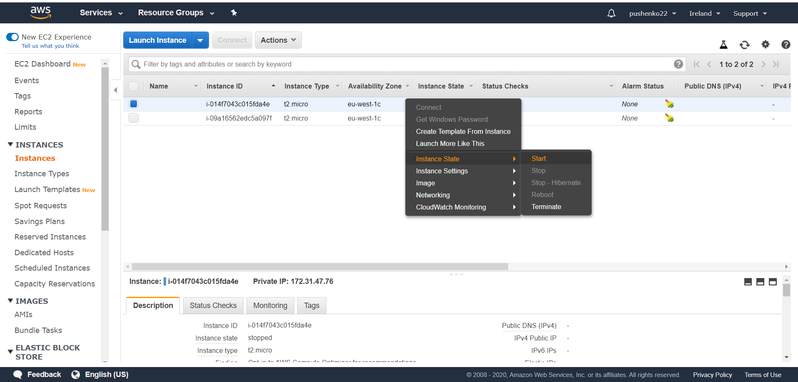

Then we connect to the instance in the next way - pressing "Connect" and copying DNS:
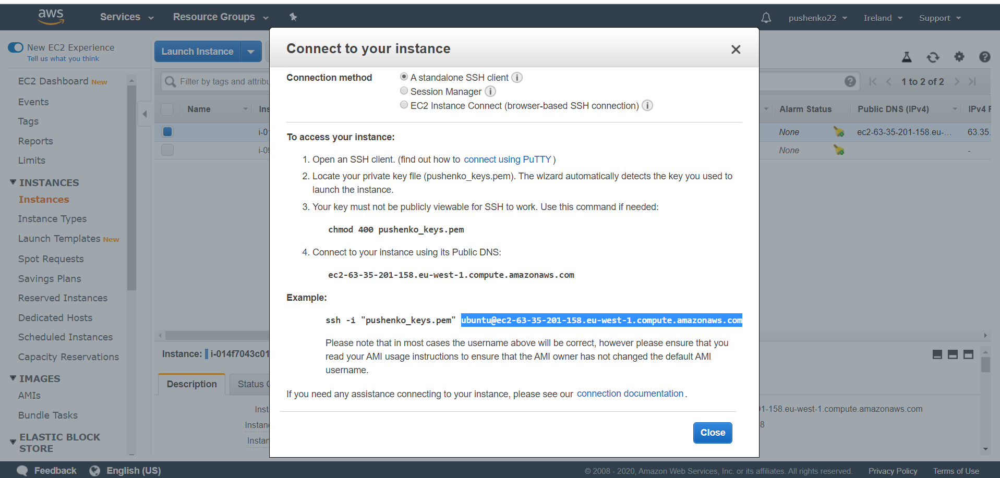

Then we launch Putty and paste DNS into "hostname"
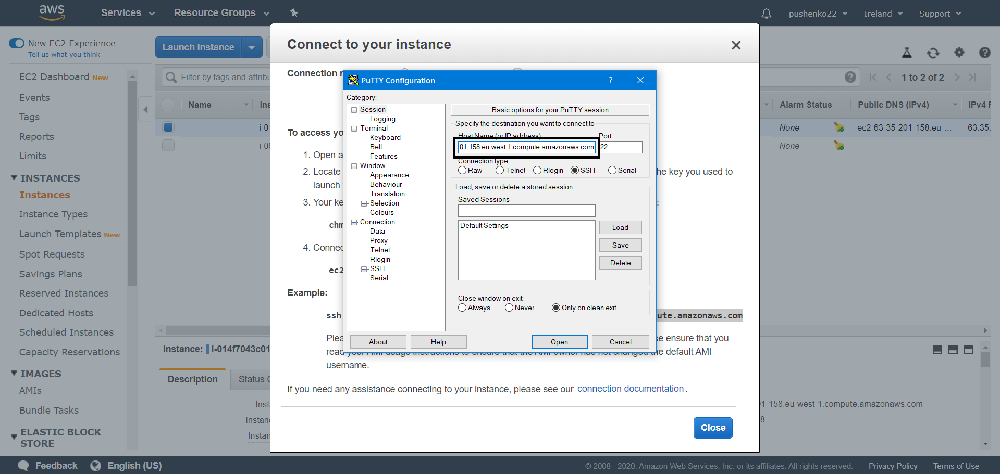
and choosing our key
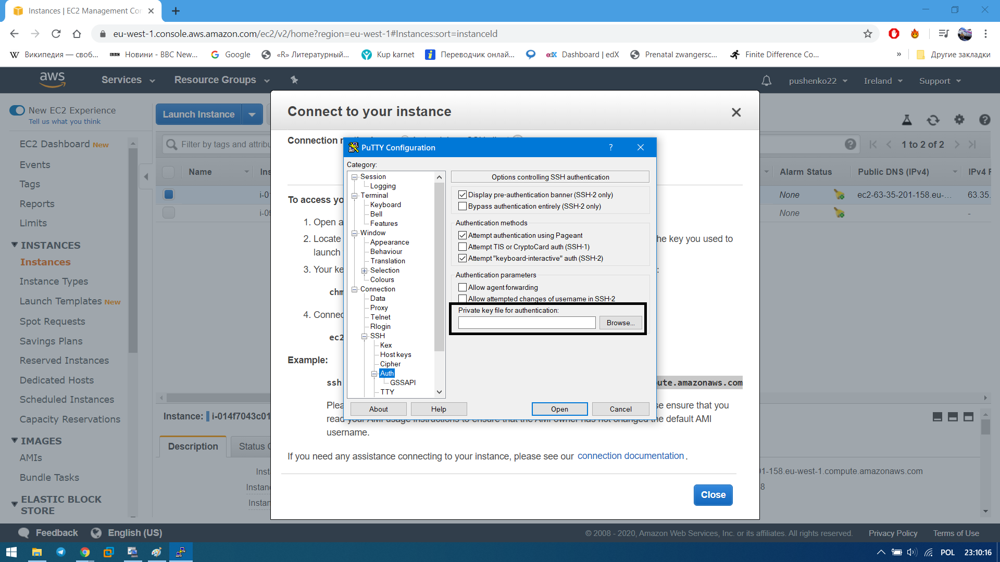
Console window was opened. Then we have to open Putty again and do the previous configuration. Then we have to configurate tunnel for cluster:
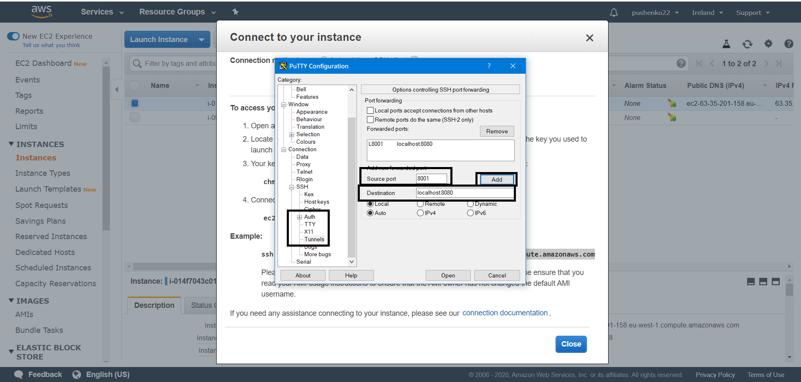
We got the next console
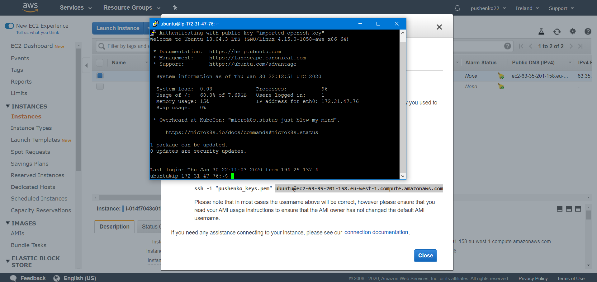

# 2. Startup Master
We have to input co console the next:
```bash 
$ cd /usr/local/spark-2.4.4-bin-hadoop2.7/sbin/
$ ./start-master.sh
```
And then copy to adress bar
```bash 
localhost:8001
```
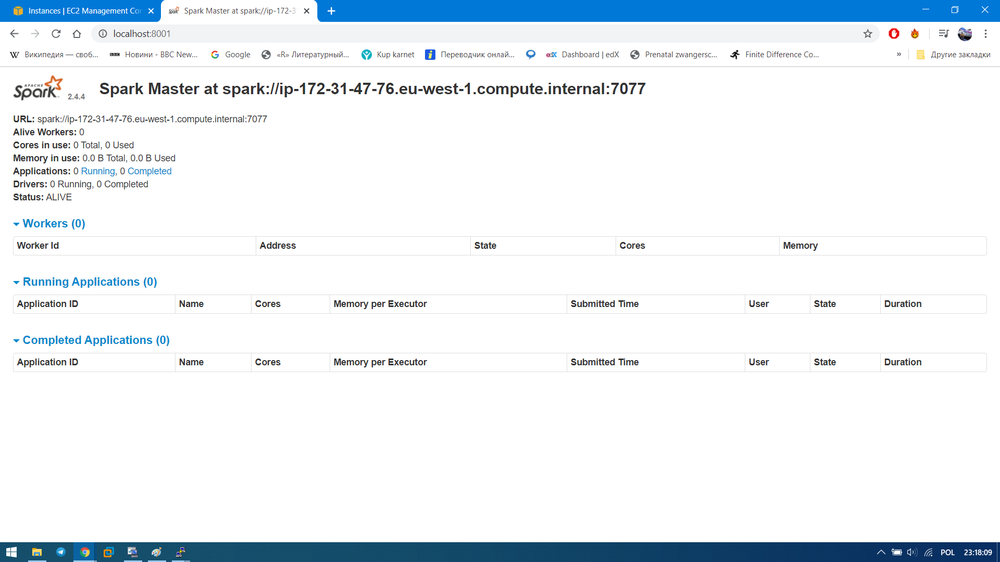
# 3. Startup Slave
For launching slave we have to copy URL:
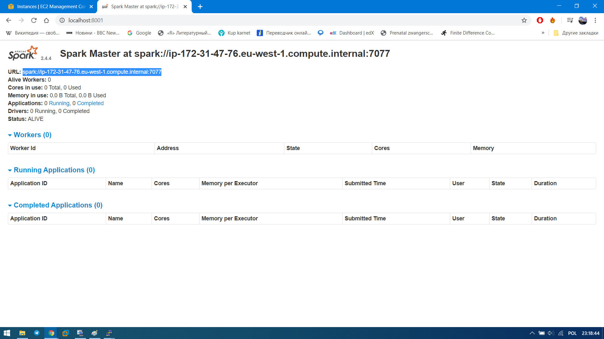
And input to console 
```bash 
$ ./start-slave.                   sh spark://ip-172-31-47-76.eu-west-1.compute.internal:7077
```
And then refresh web-page for Master and get:
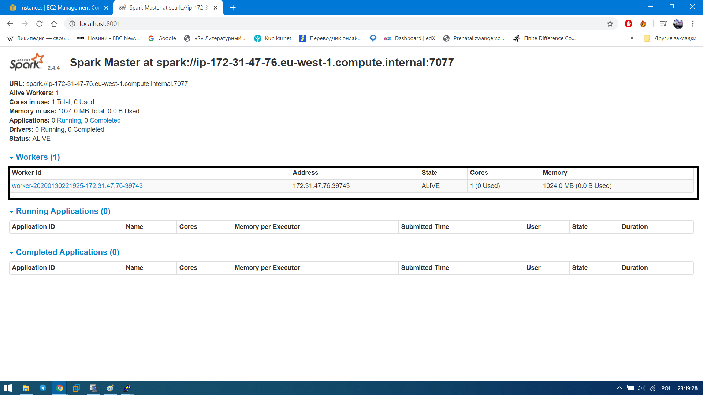
# 4. Computation
Then come back to console and input 
```bash 
$  python3 computations.py
```
We got the next result

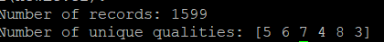

Refreshing web-page for Master we can be sure, thar Spark cluster was used for computations:
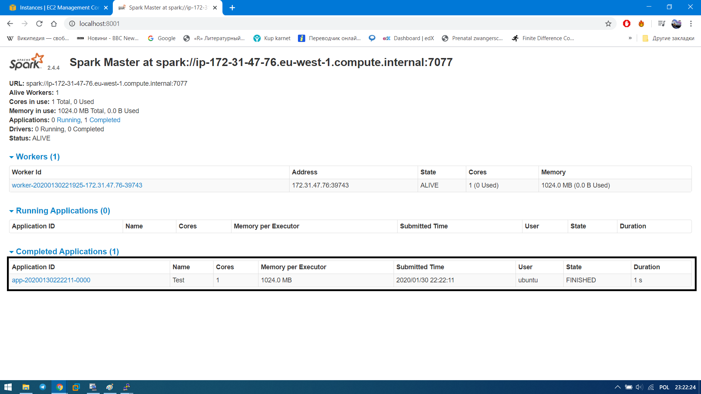
